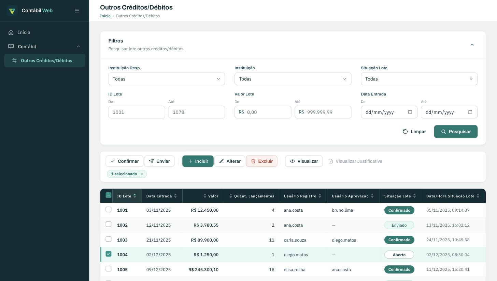
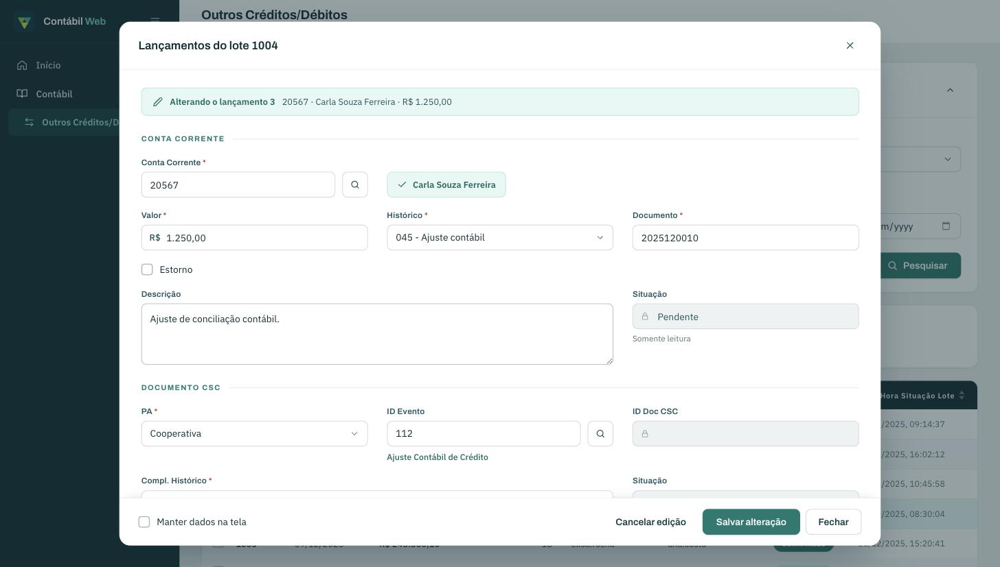
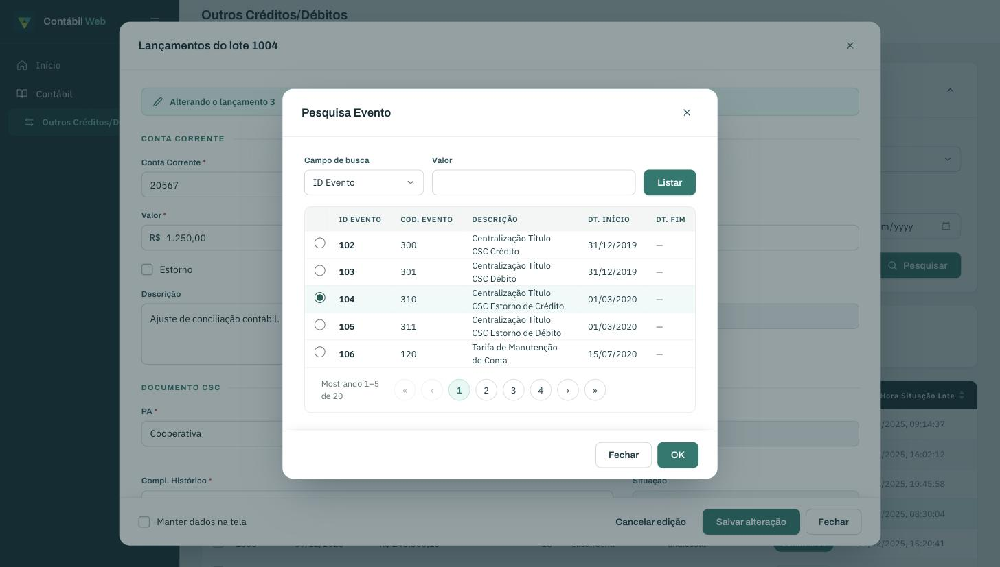

# Contábil Sicoob/Mirante case técnica - Angular 22

[](https://github.com/zrodrigolimaz/contabil-web/actions/workflows/ci.yml)

Reconstrução em Angular de duas telas do módulo contábil "Outros Créditos/Débitos" de um
sistema legado em Adobe Flex: a consulta de lotes e o modal de lançamentos. É front-end
puro; a API é simulada em memória na camada de serviço.



_Consulta de lotes: filtros, barra de ações habilitada pela seleção e grade paginada._

|  |  |
| --------------------------------------------------------------------- | --------------------------------------------------------------------------- |
| _Modal de lançamentos, alterando um lançamento_                       | _Sub-modal Pesquisa Evento, sobre o modal_                                  |

## Como executar

Requisitos: Node 22 ou mais novo (a CI usa Node 26) e npm.

```bash
npm install
npm start          # ng serve em http://localhost:4200
npm test           # Jest
npm run lint
npm run build      # build de produção
```

Angular 22.1, componentes standalone, change detection zoneless.

Os mesmos passos rodam na CI: um workflow do GitHub Actions verifica formatação, lint,
testes e build de produção a cada push e pull request, com Node 26. O badge no topo mostra
o estado atual.

## Arquitetura

```
src/app/
├── core/                    # infra sem UI; nunca importa de features
│   ├── models/              # tipos do domínio (Lote, Lancamento, filtros, paginação)
│   ├── services/            # um service por agregado; API simulada com of() + delay()
│   ├── mocks/               # massa de dados estática, separada da lógica dos services
│   ├── utils/               # funções puras (datas em fuso local, paginar)
│   └── testing/             # auxiliares de teste (fora do build da aplicação)
├── shared/                  # reutilizável e apresentacional, sem estado de negócio
│   ├── ui/                  # campo-form, campo-faixa, dialogo, dialogo-confirmacao,
│   │                        # paginacao, painel-recolhivel
│   └── validators/          # faixa (cross-field), maior-que-zero,
│                            # conta-existente e evento-existente (async)
├── layout/                  # shell: sidebar, header, breadcrumb
└── features/outros-creditos-debitos/
    ├── consulta-lotes/      # container da tela + filtros-lotes, tabela-lotes,
    │                        # barra-acoes, dialogo-justificativa
    └── lancamentos-lote/    # container do modal + formulario-lancamento,
                             # secao-conta-corrente (com pesquisa-conta),
                             # secao-documento-csc (com pesquisa-evento),
                             # grade-lancamentos, secao-anexos
```

As dependências apontam numa direção só: `features` usa `shared` e `core`, `layout` usa
`shared`, e ninguém importa de `features`.

Somente os dois containers (`consulta-lotes` e `lancamentos-lote`) injetam services e
guardam estado. Os componentes abaixo deles recebem dados por `input()` e emitem intenções
por `output()`. O estado das páginas vive em signals; derivações como "exatamente um lote
selecionado" são `computed`, nunca lógica de template. RxJS fica na borda: os services
devolvem `Observable` e o container converte na fronteira.

A pesquisa de lotes passa por um `Subject` com `debounceTime` e `switchMap`, então clique
repetido não dispara busca duplicada e resposta atrasada de consulta anterior é
descartada. A falha simulada vira resposta dentro do `switchMap` (`catchError`) e a tela
oferece "Tentar novamente" sem matar o fluxo. Para provocar o erro na prática, basta
pesquisar com ID Lote "De" igual a 999.

Os formulários (filtros e modal) são reativos e tipados com `FormBuilder.nonNullable`. A
experiência de erro é padronizada pelo componente `campo-form`: label ligado ao input,
`aria-invalid` e mensagem com `role="alert"`.

Os services filtram, ordenam e paginam em memória e respondem com
`of(...).pipe(delay(...))`. A latência é proposital: exercita o indicador de carregamento,
o debounce e a corrida de respostas que uma API real teria.

Os testes rodam em Jest com `jest-preset-angular` em ambiente zoneless. Não existe
`fakeAsync` nem `tick` nesse cenário, então a latência simulada é vencida com fake timers.
A prioridade foi validadores e services (unitários puros) e as regras de tela que o
enunciado cobra: habilitação da barra por seleção e situação, formulário inválido não
submete, seleção com estado indeterminado, ordenação.

## Onde está cada requisito

| Requisito                                                            | Onde está                                                         |
| -------------------------------------------------------------------- | ----------------------------------------------------------------- |
| Painel de filtros recolhível                                         | `consulta-lotes/filtros-lotes/` + `shared/ui/painel-recolhivel/`  |
| Faixas De/Até com validação cruzada (De ≤ Até)                       | `shared/ui/campo-faixa/` + `shared/validators/faixa.validator.ts` |
| Barra de ações com habilitação por seleção                           | `consulta-lotes/barra-acoes/`                                     |
| Tabela com seleção individual e "selecionar todos"                   | `consulta-lotes/tabela-lotes/`                                    |
| Paginação (primeira, anterior, número, próxima, última)              | `shared/ui/paginacao/`                                            |
| Conta Corrente com lupa e nome do titular                            | `lancamentos-lote/secao-conta-corrente/`                          |
| Valor obrigatório e maior que zero                                   | `shared/validators/maior-que-zero.validator.ts`                   |
| Conta existente (validação assíncrona no blur)                       | `shared/validators/conta-existente.validator.ts`                  |
| Grade de lançamentos com Visualizar/Incluir/Alterar/Excluir/Duplicar | `lancamentos-lote/grade-lancamentos/`                             |
| Formatação monetária e de datas em pt-BR                             | `LOCALE_ID` em `app.config.ts` + pipes nativos                    |

## Decisões técnicas

Usei o `<dialog>` nativo em vez do CDK Dialog. O elemento já entrega focus trap, Esc e
backdrop, então uma casca própria em `shared/ui/dialogo` bastou para padronizar cabeçalho,
corpo rolável e rodapé, sem dependência nova. O mesmo molde serve ao modal, aos sub-modais
de pesquisa e aos diálogos de confirmação e justificativa.

O projeto nasceu zoneless. Sem zone.js, a change detection depende só de signals, o que
força disciplina de estado desde o começo em vez de deixar o framework re-renderizar por
conta.

Troquei Karma por Jest pela execução mais rápida e sem navegador. O custo é não ter
`fakeAsync`; os fake timers do Jest cobrem o mesmo caso.

O estilo é Tailwind 4 com a paleta verde-petróleo definida em tokens `@theme` no
`styles.css`. Componente não usa cor solta, usa token.

Nos botões bloqueados da barra preferi `aria-disabled` a `disabled`: o botão continua
alcançável pelo teclado e aponta por `aria-describedby` para a dica que explica o motivo
do bloqueio, em vez de simplesmente sumir do fluxo de navegação.

Os sub-modais Pesquisa Conta e Pesquisa Evento têm hoje a mesma forma, e deixei a
duplicação de pé de propósito. São domínios diferentes que tendem a evoluir separados
(colunas, filtros, regras); unificar agora acoplaria por coincidência. A duplicação é
pequena, local e cada um tem seus testes.

A grade ficou fixa em 10 itens por página, espelhando o legado. Um seletor de tamanho de
página não estava no escopo.

## Escopo

Além do pedido no desafio, reconstruí a partir das telas do legado: a seção Documento CSC
completa (ID Evento com sub-modal de pesquisa paginado), a seção de Anexos (incluir,
visualizar e excluir, com "Manter dados na tela"), o sub-modal de Pesquisa de Conta
Corrente, a ordenação da grade por qualquer coluna, a exclusão de lote e as confirmações
de ação em massa.

Ficaram de fora back-end real, autenticação, persistência e as demais telas do sistema,
tudo declaradamente fora do escopo do desafio.
